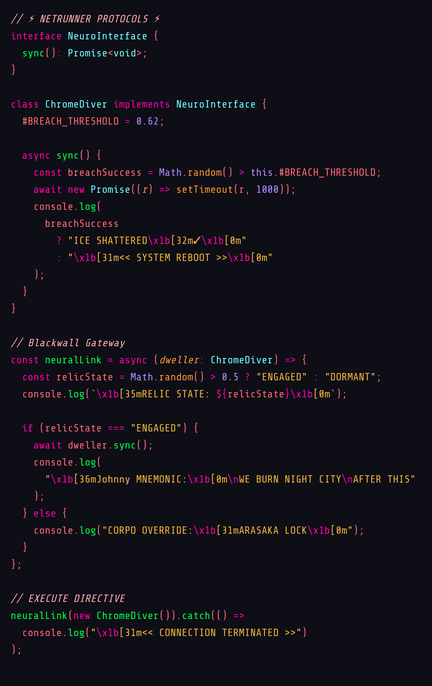

# [Arasaka Inferno - Theme](https://marketplace.visualstudio.com/items?itemName=puszkarek.arasaka-inferno-vscode-theme)

_"Wake up, Samurai. We’ve got code to burn."_

A VS Code theme that plunges your editor into the neon-soaked, corporate dystopia of **Night City**. Built for netrunners, chromed-up coders, and anyone who’d rather burn Arasaka than write a single line of legacy code.

---

## Screenshots

  
_Code never sleeps in Night City._

---

## Installation

1. **Install** the `Arasaka Inferno` extension from the [VS Code Marketplace](https://marketplace.visualstudio.com/).
2. **Open** the command palette (`Ctrl/Cmd + Shift + P`).
3. **Type**: `Preferences: Color Theme` and select `Arasaka Inferno`.
4. **Optional**: Crank your RGB peripherals to #ff3845.

---

## Features

- **Neon Hellscape**: High-contrast cyberpunk purples, blazing oranges, and Arasaka reds.
- **Synthetic Readability**: Optimized syntax highlighting for 50+ languages.
- **Dark Chrome UI**: Sleek, corp-approved interface with rebellious accents.
- **Netrunning Ready**: Token colorization sharper than a monowire.
- **Braindance Mode**: Eye-friendly variant for marathon coding sessions.

---

## Recommended Setup

- **Font**: [Share Tech Mono](https://fonts.google.com/specimen/Share+Tech+Mono?query=share+tech) _(for that authentic terminal hacker vibe)_
- **VS Code Settings**:
  ```json
  {
    "editor.fontFamily": "Share Tech Mono",
    "editor.lineHeight": 28,
    "workbench.colorTheme": "Arasaka Inferno"
  }
  ```
